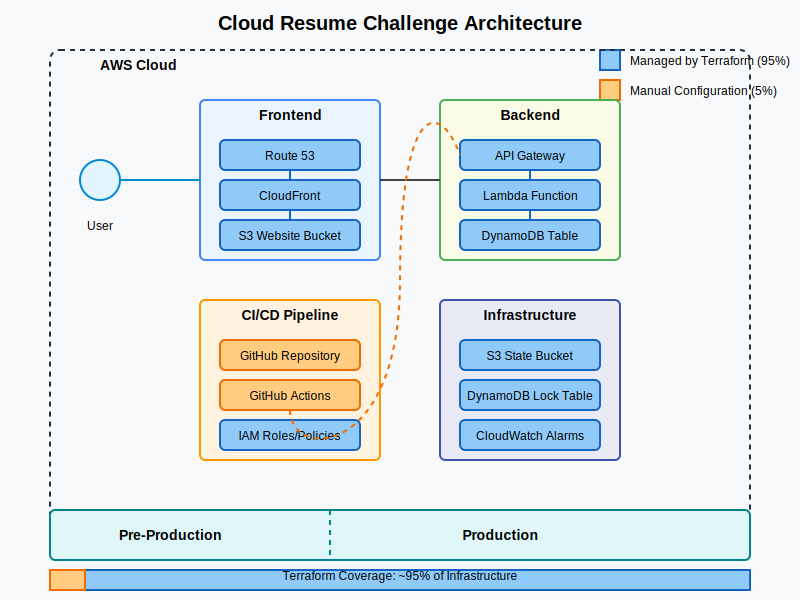

# My Cloud Resume Challenge

This is my implementation of the [Cloud Resume Challenge](https://cloudresumechallenge.dev/) using AWS serverless services and Terraform for infrastructure management.

## The Architecture

For my cloud resume, I built a completely serverless architecture on AWS. About 95% of the infrastructure is managed through Terraform, with just the GitHub repository and Actions workflows being set up manually.

### Main Components:
- **Frontend**: S3 for hosting, CloudFront for delivery, and Route 53 for DNS
- **Backend**: API Gateway, Lambda function, and DynamoDB for the visitor counter
- **CI/CD**: GitHub Actions for automating deployments
- **Multiple Environments**: Pre-production for testing and Production for the live site

## How I Built It

Here's a walkthrough of how I approached building this project. I've broken it down into phases to make it easier to follow if you want to build something similar.

### Phase 1: Setting Up the Foundation

First, I needed a reliable way to manage my infrastructure:

1. **AWS Account Structure**
   - Set up separate AWS accounts for pre-prod and prod environments
   - Created AWS CLI profiles for each environment
   - Used profile-based authentication for clear separation

2. **Terraform State Management**
   - Created separate S3 buckets in each account to store Terraform state remotely
   - Added DynamoDB tables for state locking to prevent conflicts
   - Bootstrapped the remote state infrastructure using Terraform itself

3. **Environment Structure**
   - Organized my Terraform code with reusable modules
   - Created separate directories for pre-prod and prod environments
   - Used environment-specific variable files for configuration

### Phase 2: Building the Frontend Infrastructure

For the frontend, I built everything in a logical sequence:

1. **Storage First Approach**
   - Started with S3 buckets for hosting my resume website
   - Configured the buckets with website hosting enabled
   - Set up proper bucket policies to restrict direct access

2. **Security and HTTPS**
   - Registered a domain through Route 53 console for maximum reliability
   - Created SSL certificates through ACM for HTTPS
   - Set up DNS validation for the certificates
   - Ensured certificates were in us-east-1 region for CloudFront compatibility

3. **Content Delivery**
   - Created CloudFront distributions pointing to my S3 buckets
   - Set up Origin Access Identity for S3 bucket security
   - Configured cache behaviors for optimal performance
   - Pointed my domain to CloudFront via Route 53 alias records

### Phase 3: Creating the Backend

For the visitor counter functionality, I implemented a serverless backend:

1. **Lambda Function Architecture**
   - Created a properly structured Lambda function with Node.js 20
   - Used AWS SDK v3 for improved performance and modularity
   - Implemented Lambda Layers to separate dependencies from function code
   - Set up automatic dependency management with npm

2. **Database Implementation**
   - Created a DynamoDB table for the visitor counter with on-demand capacity
   - Used a simple partition key structure for optimal performance
   - Pre-populated the counter with an initial value
   - Set up atomic counters for accurate visitor counting

3. **API Gateway Configuration**
   - Built a modern HTTP API with API Gateway v2
   - Configured proper CORS headers to allow browser access
   - Set up direct Lambda integration with payload format v2.0
   - Implemented proper error handling and status codes

4. **Security & Permissions**
   - Created IAM roles with least privilege access for Lambda
   - Set up permission boundaries for all API components
   - Added CloudWatch logging for observability
   - Implemented proper error handling in all components

### Phase 4: Frontend Integration

Connecting the frontend website to the backend services:

1. **Resume Website Development**
   - Created a clean, responsive HTML/CSS design
   - Implemented a simple yet professional resume layout
   - Used modern CSS for styling and layout

2. **API Integration**
   - Wrote JavaScript to call the visitor counter API
   - Implemented proper error handling and loading states
   - Updated the counter display in real-time
   - Added fetch API with proper CORS handling

3. **Content Delivery**
   - Uploaded website content to S3 using the AWS CLI
   - Set up efficient deployment process
   - Validated the complete end-to-end functionality

### Phase 5: Production Environment Setup (Next Steps)

The next phase is to replicate the pre-prod environment to production:

1. **Production Infrastructure**
   - Apply the same Terraform modules to the production environment
   - Use environment-specific variables and settings
   - Ensure complete isolation between environments
   - Implement additional production-specific security measures

2. **Domain Configuration**
   - Set up the production domain with proper SSL certificates
   - Configure production-specific DNS settings
   - Ensure smooth user experience with proper redirects

3. **Deployment Validation**
   - Test the complete visitor flow in production
   - Verify all components work together seamlessly
   - Ensure proper security and performance in production

### Phase 6: CI/CD Implementation (Planned)

In the future, I plan to implement CI/CD to streamline updates:

1. **GitHub Repository Organization**
   - Structure the repository with clear separation of concerns
   - Set up branch protection on main branch
   - Implement pull request workflows for code reviews

2. **GitHub Actions Workflows**
   - Create automated workflows for infrastructure deployment
   - Implement frontend build and deployment pipelines
   - Add CloudFront cache invalidation steps
   - Set up approval gates for production deployments

3. **Multi-Environment Strategy**
   - Establish clear promotion path from pre-prod to production
   - Implement automated testing before promotion
   - Create safeguards to prevent accidental production changes

## What I've Learned So Far

Building this project has taught me valuable lessons about serverless architecture and infrastructure as code:

- **AWS Profile Management** - Setting up separate AWS profiles for different environments ensures clean separation of resources
- **Remote State Management** - Properly configuring Terraform backend with S3 and DynamoDB provides reliable state storage and locking
- **Module-Based Architecture** - Organizing Terraform code into reusable modules creates maintainable infrastructure
- **Lambda Best Practices** - Structuring Lambda functions with proper dependency management using Lambda Layers
- **DynamoDB Design** - Designing simple yet effective NoSQL data structures for serverless applications
- **API Gateway Configuration** - Setting up modern HTTP APIs with proper CORS and Lambda integration
- **Security Best Practices** - Applying least privilege principle for all IAM roles and policies

## Debugging Journey

Throughout this project, I encountered and resolved several challenges. Here's a look at key issues and how I tackled them:

| Issue | Debugging Approach | Solution |
|-------|-------------------|----------|
| **IAM Permissions for ACM** | Identified missing ACM management permissions based on API error messages | Added AmazonCertificateManagerFullAccess policy to user |
| **Lambda Runtime Deprecation** | Error message indicated nodejs14.x runtime was no longer supported | Updated to nodejs20.x in Terraform configuration |
| **AWS SDK Missing in Lambda** | Direct Lambda invocation via CLI revealed module import failure | Implemented Lambda Layers to properly manage dependencies with AWS SDK v3 |
| **AWS Profile Confusion** | Used `aws sts get-caller-identity` to check actual user being used | Fixed AWS credentials configuration to use correct profile |
| **Certificate Region Mismatch** | Analyzed CloudFront requirements and certificate errors | Added specific us-east-1 provider for ACM resources (CloudFront requirement) |
| **API Connection Failures** | Used curl to test API directly and examined browser console errors | Fixed API endpoint URL and verified CORS configuration |
| **Module Path References** | Examined file structure and Terraform error messages | Updated module source paths to use correct relative paths |

These experiences reinforced the importance of:
- Understanding AWS service dependencies and regional requirements
- Properly structuring serverless applications with current best practices
- Using systematic debugging approaches with proper tools (AWS CLI, curl, etc.)
- Implementing strong IAM policies while maintaining practicality

## Current Challenges & Next Steps

As I continue to develop this project, I'm focusing on these key areas:

1. **Production Environment** - Setting up the production environment with the same infrastructure but proper isolation
2. **Enhanced Security** - Implementing additional security measures like AWS WAF and stricter IAM policies
3. **Monitoring & Observability** - Adding comprehensive CloudWatch dashboards and alerts
4. **Frontend Improvements** - Enhancing the resume design and visitor counter functionality
5. **CI/CD Pipeline** - Implementing automated deployments and testing with GitHub Actions

## Helpful Resources

If you're looking to build something similar, these resources were invaluable:
- [Terraform Documentation](https://www.terraform.io/docs)
- [AWS Documentation](https://docs.aws.amazon.com/)
- [Cloud Resume Challenge](https://cloudresumechallenge.dev/)
